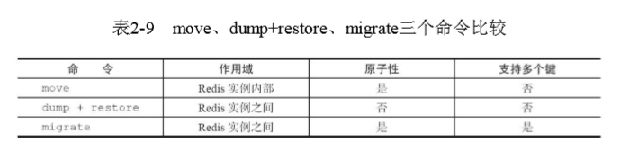

### 一、常用命令

- keys pattern    # 查看所有键，令会遍历所有键，所以它的时间复杂度是O（n），当Redis保存了大量键时，线上环境禁止使用。支持匹配模式，当pattern 为 * 时，表示查看所有键。

- dbsize # 查看键总数，dbsize命令在计算键总数时不会遍历所有键，而是直接获取Redis内置的 键总数变量，所以dbsize命令的时间复杂度是O（1）。

- exists key # 检查键是否存在，键存在则返回1，不存在则返回0。

- del key # 删除键，无论值是什么数据结构类型，del命令都可以将其 删除，返回结果为成功删除键的个数，假设删除一个不存在的键，就会返回0，支持同时删除多个键：`del key1 key2 key3`

#### 键过期

- expire key seconds #设置键过期
- expireat key timestamp # 键在秒级时间戳timestamp后过期。
- pexpire key milliseconds # 键在milliseconds毫秒后过期。
- pexpireat key milliseconds-timestamp # 键在毫秒级时间戳timestamp后过期。
- persist key # 清除键的过期时间

    注意：

    ​	1. 无论是使用过期时间还是时间戳，秒级还是毫秒级，在Redis内部最 终使用的都是pexpireat。

    ​	2. **对于字符串类型键，执行set命令会去掉过期时间**

    ​	3. Redis不支持二级数据结构（例如哈希、列表）内部元素的过期功能 

    ​	4. setex命令作为set+expire的组合，不但是原子执行，同时减少了一次网络通讯的时间.

- ttl key # 返回键的剩余时间，-1：表示没有设置过期时间（永不过期），-2：键不存在（已经过期被删除）

- type key # 键的数据结构类型，键不存在返回none

- object encoding key # 查询内部编码

#### 键重命名

- rename key newkey # 键重命名
- renamenx key newkey # 确保只有newKey 不存在时候才被覆盖,返回结果是0代表没有完成重命名
- randomkey # 随机返回一个键

#### 键迁移

- move key db # 把指定的键从源数据库移动到目标数据库中，但多数据库功能不建议在生产环境使用，所以这个命令读者知道即可。

- dump+restore 

```
dump key # 将键值序列化，格式采用的是RDB格式

restore key ttl value # 将上面序列化的值进行复原，其中ttl参数代表过期时间，如果ttl=0代表没有过期时间。
```

​	注意：

​	1. 整个迁移过程并非原子性的，而是通过客户端分步完成的  
​	2. 迁移过程是开启了两个客户端连 接，所以dump的结果不是在源Redis和目标Redis之间进行传输


- migrate

  ```
  migrate host port key|"" destination-db timeout [copy] [replace] ·[keys key[key...]]
  ```

  注意：

  ​	1. 整个过程是原子执行的，不需要在多个Redis实例上开启 客户端的，只需要在源Redis上执行migrate命令即可。

  ​	2. migrate命令的 数据传输直接在源Redis和目标Redis上完成的。

  ​	3. 目标Redis完成restore 后会发送OK给源Redis，源Redis接收后会根据migrate对应的选项来决定是否 在源Redis上删除对应的键。

  >下面对migrate的参数进行逐个说明：
  >host：目标Redis的IP地址。
  >port：目标Redis的端口。
  >key|""：在Redis3.0.6版本之前，migrate只支持迁移一个键，所以此处是 要迁移的键，但Redis3.0.6版本之后支持迁移多个键，如果当前需要迁移多 个键，此处为空字符串""。
  >destination-db：目标Redis的数据库索引，例如要迁移到0号数据库，这里就写0。
  >timeout：迁移的超时时间（单位为毫秒）。
  >[copy]：如果添加此选项，迁移后并不删除源键。
  >[replace]：如果添加此选项，migrate不管目标Redis是否存在该键都会正常迁移进行数据覆盖。
  >[keys key[key...]]：迁移多个键，例如要迁移key1、key2、key3，此处填 写“keys key1 key2 key3”

  

  #### 遍历键

  `scan cursor [match pattern][count number]` # ，scan采用渐进式遍历 的方式来解决keys命令可能带来的阻塞问题，每次scan命令的时间复杂度是 O（1），但是要真正实现keys的功能，需要执行多次scan

  > cursor是必需参数，实际上cursor是一个游标，第一次遍历从0开始，每 次scan遍历完都会返回当前游标的值，直到游标值为0，表示遍历结束。
  > match pattern是可选参数，它的作用的是做模式的匹配，这点和keys的
  > 模式匹配很像。
  > count number是可选参数，它的作用是表明每次要遍历的键个数，默认 值是10，此参数可以适当增大。

  除了scan以外，Redis提供了面向哈希类型、集合类型、有序集合的扫 描遍历命令，解决诸如hgetall、smembers、zrange可能产生的阻塞问题，对 应的命令分别是hscan、sscan、zscan，它们的用法和scan基本类似

  #### 数据库管理

  - select dbIndex # 切换数据库
    - 建议如果要使用多个数据库功能，完全可以在一台机器上部署多个 Redis实例，彼此用端口来做区分，因为现代计算机或者服务器通常是有多 个CPU的。这样既保证了业务之间不会受到影响，又合理地使用了CPU资源。
  - flushdb/flushall # 清除数据库，两者的区别的是flushdb只清除当 前数据库，flushall会清除所有数据库

### 二、单线程架构

​	Redis使用了**单线程架构**（解决并发问题）和**I/O多路复用模型**（解决I/O问题）来实现高性能的内存数据库 服务。

​	单线程的特点：

1. 单线程避免了线程切换和竞态产生的消耗。
2. 可以简化数据结构和算法的实现。
3. 对于每个命令的执行时间是有要求的。如果 某个命令执行过长，会造成其他命令的阻塞。
4. 很多存储系统和编程语言内部使用CAS机制实现计数功能，会有一定的 CPU开销，但在Redis中完全不存在这个问题，因为Redis是单线程架构，任 何命令到了Redis服务端都要顺序执行。