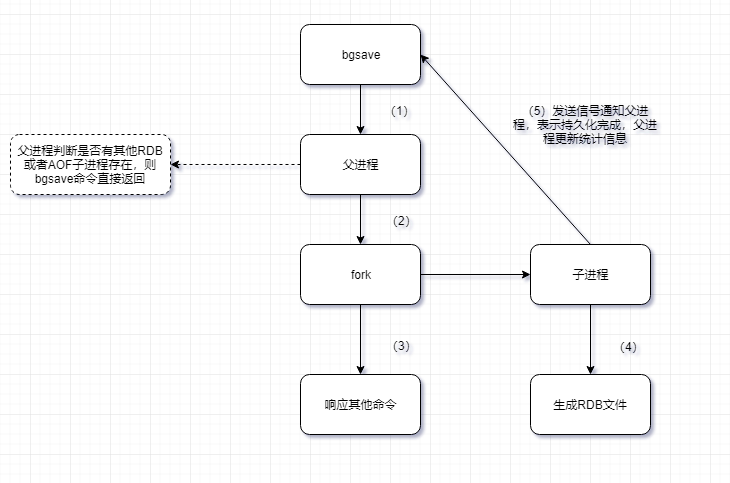

### 定义

在指定的**时间间隔内**把内存中进程数据生成快照保存到硬盘的过程盘，也就是Snapshot快照，它恢复时是将快照文件（**特定二进制格式**）直接读到内存里，触发RDB持久化过程分为手动触发和自动触发。

### 触发机制

手动触发分别对应save和bgsave命令

- save命令（**已经废弃**）

    阻塞当前Redis服务器，直到RDB过程完成为止，对于内存比较大的实例会造成长时间阻塞，线上环境不建议使用。

- bgsave命令（**是针对save阻塞问题做的优化**）

    Redis进程执行fork操作创建子进程，RDB持久化过程由子进程负责，完成后自动结束。阻塞只发生在fork阶段，一般时间很短，因此Redis内部所有的涉及RDB的操作都采用bgsave的方式。

自动触发

1. 使用save相关配置，如“save m n”。表示m秒内数据集存在n次修改 时，自动触发bgsave。
2. 如果从节点执行全量复制操作，主节点自动执行bgsave生成RDB文件并发送给从节点。
3. 执行`debug reload`命令重新加载Redis时，也会自动触发save操作。
4. 默认情况下执行shutdown命令时，如果没有开启AOF持久化功能则 自动执行bgsave。

### 持久化流程

1. 触发bgsave命令，当前进程（父进程）判断是否还有其他RDB或者AOF子进程在执行，如果有，则直接返回。
2. fork一个与当前进程（父进程）完全一样（包括变量，环境变量，程序计数器等）的子进程。
3. 当前进程（父进程）继续执行其他命令
4. 子进程创建RDB文件，根据父进程内存生成临时快照文件，完成后对原有文件进行原子替换。执行`lastsave`命令可以获取最后一次生成RDB的时间，对应info统计的`rdb_last_save_time`选项。
5. 子进程发送信号通知父进程持久化完成，父进程更新统计信息，具体见 info Persistence下的rdb_*相关选项。

### RDB文件的处理

1. 保存

    RDB文件保存在dir配置指定的目录下，文件名通过dbfilename配置指定。可以通过执行`config set dir{newDir}`和`config set dbfilename{newFileName}`运行期动态执行，当下次运行时RDB文件会保存到新目录。
2. 压缩

    Redis默认采用LZF算法对生成的RDB文件做压缩处理，压缩后的 文件远远小于内存大小，默认开启，可以通过参数config set rdbcompression{yes|no}动态修改。
3. 校验

    如果Redis加载损坏的RDB文件时拒绝启动，可以使用Redis提供的redis-check-dump工具检测RDB文件并获取对应的错误报告。

### 优点
1. 适合大规模的数据恢复
2. 对于数据的完整性和一致性要求不高
3. Redis加载RDB恢复数据远远快于AOF的方式。

### 缺点
1. 没办法做到实时持久化/秒级持久化。因为bgsave每次运 行都要执行fork操作创建子进程，属于重量级操作，频繁执行成本过高。
2. 可能会出现最后一次备份失败
3. Fork的时候，内存中数据被备份了一次，需要考虑接近两倍的空间的问题
4. RDB文件使用特定二进制格式保存，Redis版本演进过程中有多个格式 的RDB版本，存在老版本Redis服务无法兼容新版RDB格式的问题。

### 相关命令

save 秒钟 操作次数

save 900  1 # 900秒内key被修改至少1次，进行保存操作

bgsave 秒钟 操作次数

### 如何停止

config set save ""  # 使备份失效

### 注意事项
flushall命令执行完之后，shutdown生成的新rdb文件（默认dump.rdb）里面也是空，后续即使回复也是空的。