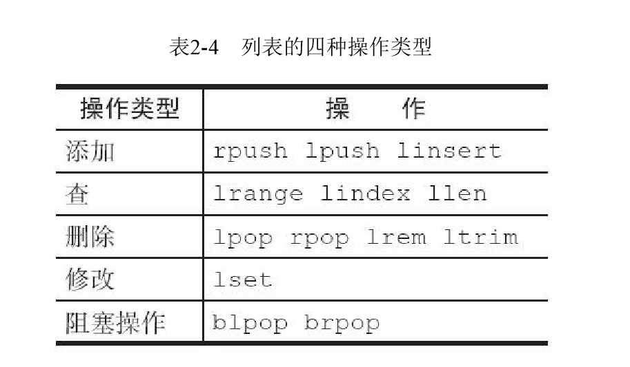
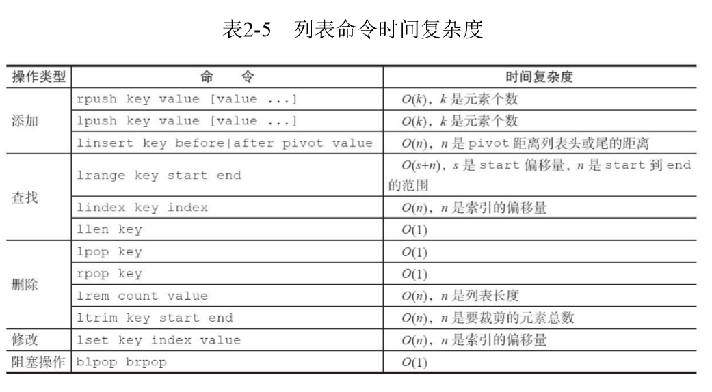

列表（list）类型是用来存储多个有序的字符串，在Redis中，可 以对列表两端插入（push）和弹出（pop），还可以获取指定范围的元素列 表、获取指定索引下标的元素等（如图2-18和图2-19所示）。列表是一种比
较灵活的数据结构，它可以充当栈和队列的角色。

特点：有序可重复

### 1. 常用命令

插入

- lpush key value [value ...]  #  从左边插入元素
- rpush key value [value ...] #  从右边插入元素
- linsert key before|after pivot value # linsert命令会从列表中找到等于pivot的元素，在其前（before）或者后 （after）插入一个新的元素value，返回当前列表的长度

查询

- lrange key start end # 获取指定范围内的元素列表
- lindex key index # 获取列表指定索引下标的元素
- llen key #  获取列表长度

删除

- lpop key # 从列表左侧弹出元素
- rpop key # 从列表右侧弹出
- lrem key count value #  从列表中找到等于value的元素进行删除
  - count>0，从左到右，删除最多count个元素。
  - count<0，从右到左，删除最多count绝对值个元素。
  - count=0，删除所有。

修改

- ltrim key start end # 按照索引范围修剪列表
- lset key index newValue # 修改指定索引下标的元素

阻塞

- blpop key [key ...] timeout  # timeout的单位为秒
- brpop key [key ...] timeout  # timeout的单位为秒

blpop和brpop是lpop和rpop的阻塞版本，它们除了弹出方向不同，使用 方法基本相同。

1）列表为空：如果timeout=3，那么客户端要等到3秒后返回，如果 timeout=0，那么客户端一直阻塞等下去

2）列表不为空：客户端会立即返回。

注意事项：

1. 如果是多个键，那么brpop会从左至右遍历键，一旦有一个键能弹出元素，客户端立即返回
2. 如果多个客户端对同一个键执行brpop，那么最先执行brpop命令的客户端可以获取到弹出的值。

### 2. 时间复杂度

### 3. 内部编码

- ziplist（压缩列表）：当列表的元素个数小于list-max-ziplist-entries配置 （默认512个），同时列表中每个元素的值都小于list-max-ziplist-value配置时 （默认64字节），Redis会选用ziplist来作为列表的内部实现来减少内存用
- linkedlist（链表）：当列表类型无法满足ziplist的条件时，Redis会使用 linkedlist作为列表的内部实现。
- Redis3.2版本提供了quicklist内部编码，简单地说它是以一个ziplist为节 点的linkedlist，它结合了ziplist和linkedlist两者的优势，为列表类型提供了一 种更为优秀的内部编码实现，它的设计原理可以参考Redis的另一个作者 Matt Stancliff的博客：https://matt.sh/redis-quicklist

### 4. 使用场景

- 文章列表

- lpush+lpop=Stack（栈）

- lpush+rpop=Queue（队列）

- lpush+ltrim=Capped Collection（有限集合）

- lpush+brpop=Message Queue（消息队列）

  Redis的lpush+brpop命令组合即可实现阻塞队列，生产 者客户端使用lrpush从列表左侧插入元素，多个消费者客户端使用brpop命令 阻塞式的“抢”列表尾部的元素，多个客户端保证了消费的负载均衡和高可用
  性。