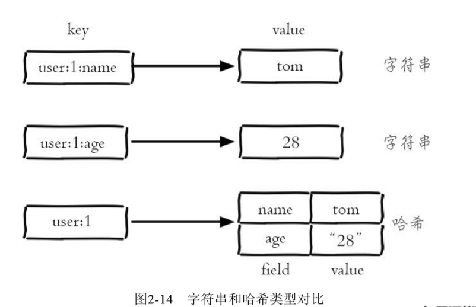
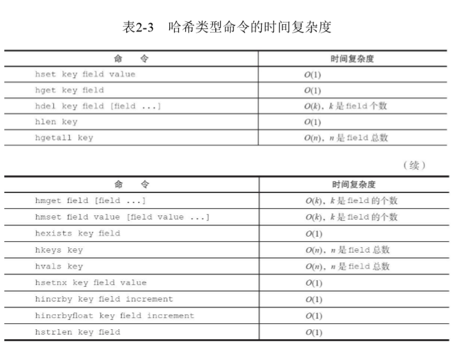

​	几乎所有的编程语言都提供了哈希（hash）类型，它们的叫法可能是哈 希、字典、关联数组。在Redis中，**哈希类型是指键值本身又是一个键值对 结构**，形如value={{field1，value1}，...{fieldN，valueN}}，Redis键值对和 哈希类型二者的关系。

​	如下图：



**注意**：哈希类型中的映射关系叫作field-value，注意这里的value是指field对应 的值，不是键对应的值，请注意value在不同上下文的作用。


哈希类型和关系型数据库有两点不同之处：

1. 哈希类型是稀疏的，而关系型数据库是完全结构化的，，例如哈希类型 每个键可以有不同的field，而关系型数据库一旦添加新的列，所有行都要为 其设置值（即使为NULL）

2. 关系型数据库可以做复杂的关系查询，而Redis去模拟关系型复杂查询开发困难，维护成本高。

### 1. 常用命令

（1）设置值

​	hset key field value # 设置成功会返回1，反之会返回0

​	此外Redis提供了hsetnx命令，它 们的关系就像set和setnx命令一样，只不过作用域由键变为field。

（2）获取值

​	hget key field # 如果键或field不存在，会返回nil

（3）删除field

​	hdel key field [field ...]  #  hdel会删除一个或多个field，返回结果为成功删除field的个数

（4）计算field个数

​	hlen key

（5）批量设置或获取field-value

​	hmget key field [field ...] 

​	hmset key field value [field value ...]

（6）判断field是否存在

​	hexists key field  #  存在返回结果为1，不存在时返回0

（7）获取所有field

​	hkeys key #  返回指定哈希键所有的field

（8）获取所有value

​	hvals key # 只返回field对应的value

（9）获取所有的field-value

​	hgetall key # 返回filed和value

​	在使用hgetall时，如果哈希元素个数比较多，会存在阻塞Redis的可能。 如果开发人员只需要获取部分field，可以使用hmget，如果一定要获取全部 field-value，可以使用hscan命令，该命令会渐进式遍历哈希类型

（10）hincrby hincrbyfloat

​	hincrby和hincrbyfloat，就像incrby和incrbyfloat命令一样，但是它们的作 用域是filed。

（11）计算value的字符串长度（需要Redis3.2以上）

​	hstrlen key field

### 2. 时间复杂度



### 3. 内部编码

​哈希类型的内部编码有两种：

- ziplist（压缩列表）：当哈希类型元素个数小于hash-max-ziplist-entries 配置（默认512个）、同时**所有值**（有一个值大于64也不满足条件）都小于hash-max-ziplist-value配置（默认64 字节）时，Redis会使用ziplist作为哈希的内部实现，ziplist使用更加紧凑的结构实现多个元素的连续存储，所以在节省内存方面比hashtable更加优秀。
- hashtable（哈希表）：当哈希类型无法满足ziplist的条件时，Redis会使 用hashtable作为哈希的内部实现，因为此时ziplist的读写效率会下降，而 hashtable的读写时间复杂度为O（1）。

### 4. 使用场景

- 缓存用户信息

三种方法缓存用户信息，下面给出三种方案的实现方法和优缺点分析：

​	1）原生字符串类型：每个属性一个键。

```
set user:1:name tom 
set user:1:age 23 
set user:1:city beijing
```

​	优点：简单直观，每个属性都支持更新操作。
​	缺点：占用过多的键，内存占用量较大，同时用户信息内聚性比较差，
​	所以此种方案一般不会在生产环境使用。	

​	2）序列化字符串类型：将用户信息序列化后用一个键保存。

```
set user:1 serialize(userInfo)
```

​	优点：简化编程，如果合理的使用序列化可以提高内存的使用效率

​	缺点：序列化和反序列化有一定的开销，同时每次更新属性都需要把全 部数据取出进行反序列化，更新后再序列化到Redis中。

​	3）哈希类型：每个用户属性使用一对field-value，但是只用一个键保存。	

```
hmset user:1 name tomage 23 city beijing
```

​	优点：简单直观，如果使用合理可以减少内存空间的使用。
​	缺点：要控制哈希在ziplist和hashtable两种内部编码的转换，hashtable会消耗更多内存。	