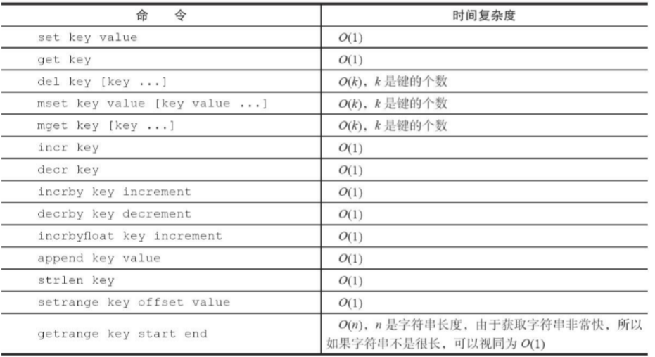

​	字符串类型是Redis最基础的数据结构。首先键都是字符串类型，而且其他几种数据结构都是在字符串类型基础上构建的，字符串类型的值实际可以 是字符串（简单的字符串、复杂的字符串（例如JSON、XML））、数字
（整数、浮点数），甚至是二进制（图片、音频、视频），但是值最大不能 超过512MB。

### 1. 常用命令

1）设置值

```
set key value [ex seconds][px milliseconds] [nx|xx]
```

>set命令有几个选项：
>ex seconds：为键设置秒级过期时间。
>px milliseconds：为键设置毫秒级过期时间。
>nx：键必须不存在，才可以设置成功，用于添加。
>xx：与nx相反，键必须存在，才可以设置成功，用于更新。

除了set选项，Redis还提供了setex和setnx两个命令:

```
setex key seconds value 
setnx key value
```

根据setnx的特性只有一个客户端能设置成功，setnx可以作为分布式锁的一种 实现方案

2)  获取值

```
get key # 要获取的键不存在，则返回nil
```

3)  批量设置值

```
mset key value [key value ...]
```

4）批量获取值

```
mget key [key ...] # 如果有些键不存在，那么它的值为nil（空），结果是按照传入键的顺序返回
```

5）计数

```
incr key # 自增

>值不是整数，返回错误。
>值是整数，返回自增后的结果。
>键不存在，按照值为0自增，返回结果为1。

除了incr,Redis还提供了decr（自减）、incrby（自增指定数字）、 decrby（自减指定数字）、incrbyfloat（自增浮点数）。
```
### 2. 不常用命令

append key value # 向字符串尾部追加值

strlen key # 字符串长度

getset key value # 设置并返回原值

setrange key offeset value # 设置指定位置的字符

getrange key start end # 获取部分字符串，start和end分别是开始和结束的偏移量，偏移量从0开始计算

### 3. 时间复杂度



### 4. 内部编码

字符串类型的内部编码有3种：

- int：8个字节的长整型。

- embstr：小于等于39个字节的字符串。

- raw：大于39个字节的字符串。

Redis会根据当前值的类型和长度决定使用哪种内部编码实现。

### 5. 使用场景

- 缓存
- 计数，如视频播放数计数
- 共享session，分布式服务
- 限速，如短信验证码，同一IP单位时间内访问次数