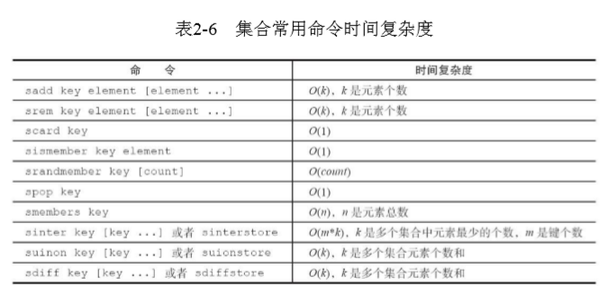

特点：

- 无序不重复，
- 一个集合最多可以存储2^32-1个元 素
- Redis除了支持集合内的增删改查，同时还支持多个集合取交集、并集、差集

### 1. 常用命令

- sadd key element [element ...] # 添加元素，返回结果为添加成功的元素个数
- srem key element [element ...] # 删除元素，返回结果为成功删除元素个数
- scard key # 计算元素个数，scard的时间复杂度为O（1），它不会遍历集合所有元素，而是直接用 Redis内部的变量，
- sismember key element # 判断元素是否在集合中，在集合内返回1，反之返回0
- srandmember key [count] # 随机从集合返回指定个数元素，[count]是可选参数，如果不写默认为1
- spop key   [count] # 从集合随机弹出元素，[count]是可选参数，如果不写默认为1

srandmember和spop都是随机从集合选出元素，两者不同的是spop命令 执行后，元素会从集合中删除，而srandmember不会。

- smembers key # 获取所有元素，smembers和lrange、hgetall都属于比较重的命令，如果元素过多存在阻 塞Redis的可能性，这时候可以使用sscan来完成

集合间操作

- sinter key [key ...] # 求多个集合的交集
- suinon key [key ...] # 求多个集合的并集
- sdiff key [key ...] # 求多个集合的差集

将交集、并集、差集的结果保存

- sinterstore destination key [key ...] 
- suionstore  destination key [key ...] 
- sdiffstore  destination key [key ...]

### 2. 时间复杂度

### 3. 内部编码

- intset（整数集合）：当集合中的元素都是整数且元素个数小于set-maxintset-entries配置（默认512个）时，Redis会选用intset来作为集合的内部实
  现，从而减少内存的使用。
- hashtable（哈希表）：当集合类型无法满足intset的条件时，Redis会使 用hashtable作为集合的内部实现。	

### 4. 使用场景

- 标签
  - 用户和标签的关系维护应该在一个事务内执行，防止部分命令失败造成的数据不一致
- sadd=Tagging（标签）
- spop/srandmember=Random item（生成随机数，比如抽奖）
- sadd+sinter=Social Graph（社交需求）